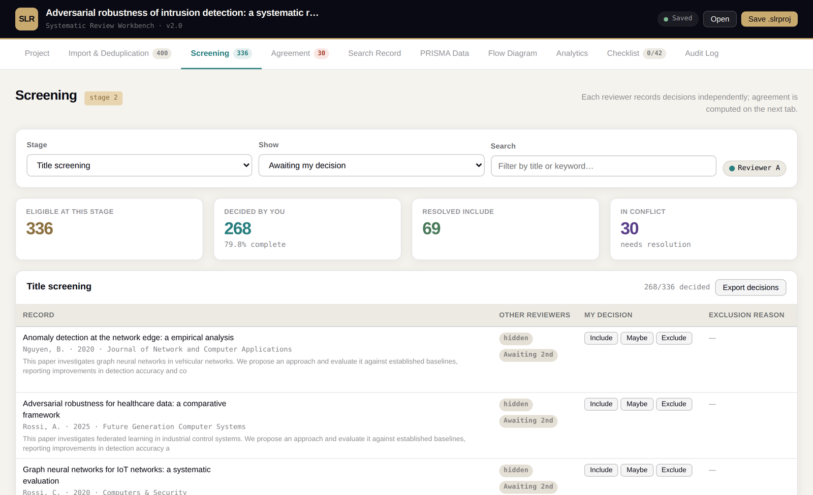
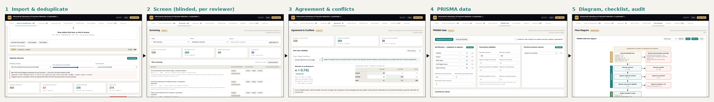

# SLR Workbench

An offline, single-file workbench for conducting and reporting systematic literature reviews.

[](LICENSE)
[](CHANGELOG.md)
[](#privacy-and-where-your-data-lives)

SLR Workbench takes a review from the first database export to the submitted PRISMA 2020 flow diagram. It is one HTML file. It opens in any modern browser with no installation, no server and no network connection, keeps every record and decision on your own machine, and saves to a portable project file that co-reviewers can exchange and merge.



## What it does

| Stage | What the Workbench provides |
|---|---|
| Question and protocol | Review type, question framework (PICO, PECO, PCC, SPIDER, PIRD, PICo), registration and search-date fields, reviewer register |
| Search | A PRISMA-S style search record (per-database string, filters, date, counts) with CSV, LaTeX and Markdown export |
| Import | RIS, BibTeX, NBIB/MEDLINE, CSV and TSV parsers; every import attributed to a named database; DOI normalisation |
| Deduplication | DOI exact match, then blocked fuzzy title matching with a bounded edit distance, year tolerance and a guard against transitive chaining; duplicates are flagged, never silently deleted |
| Screening | Title, abstract and full-text stages; one decision per reviewer per stage; blinded mode; fixed exclusion reasons; tables that stay responsive at thousands of records |
| Agreement | Cohen's kappa with standard error, 95 per cent confidence interval and contingency table; Fleiss' kappa for three or more reviewers; explicit treatment of "maybe" votes; a conflict queue with attributed resolution |
| Reporting | PRISMA 2020 counts derived from the decisions with logged overrides and arithmetic consistency checks; the two-arm flow diagram as SVG or PNG; the full 27-item checklist with a location field; analytics charts |
| Provenance | An append-only audit log of every change, exportable as CSV |
| Persistence | Autosave to the browser (IndexedDB, with a localStorage fallback), a portable `.slrproj` file, and a merge that folds in a co-reviewer's decisions without overwriting your own |

## Quick start

There are three ways to run it. All three give you the same application.

1. Download and open. Save [`dist/SLR_Workbench_v2.0.0.html`](dist/SLR_Workbench_v2.0.0.html) anywhere on your computer and double-click it. It runs from the file, offline.
2. Use the hosted copy. If GitHub Pages is enabled for this repository, the application is served at `https://USERNAME.github.io/slr-workbench/`. Nothing you enter leaves your browser; the page is static.
3. Clone and build. `git clone`, then `node build.js` assembles `index.html` from the parts in `src/`.

Then, in the application:

1. On the Project tab, name the review, choose the question framework, and check the two reviewers that are registered by default (rename them or add more).
2. On the Import tab, drop one export per database. Name the database each file came from when asked; that attribution is what lets the flow diagram list sources separately. Or press "Load 400-record sample" to try the tool with synthetic data.
3. Run duplicate detection, inspect the flagged groups, and remove them when satisfied.
4. Screen. Each reviewer selects themselves under "Screening as" and works through the records. With blinded mode on, neither sees the other's decisions until their own are recorded.
5. On the Agreement tab, read the kappa and resolve the conflict queue.
6. On the PRISMA Data tab, recalculate the counts from the decisions, fill in the figures the tool cannot know (reports not retrieved, for instance), and read the consistency checks.
7. Export the flow diagram, complete the checklist, and export the audit log for your methods section.

A worked example is included: open [`examples/sample_review.slrproj`](examples/sample_review.slrproj) from the Project tab to see every part of the tool populated with a small review assembled from the four example exports in [`examples/`](examples/).

## The workflow



Records enter once per database, are deduplicated, screened independently by each reviewer, reconciled, and reported. The counts on the PRISMA Data tab and in the diagram are derived from the recorded decisions rather than typed in, and any figure you override is logged with the derived value it replaced.

The application has ten tabs:

| Tab | Purpose |
|---|---|
| Project | Review details, reviewer register, blinded mode, project file save/open/merge, storage status |
| Import & Deduplication | Drop citation files, attribute each to a database, run and inspect duplicate detection, browse records |
| Screening | Record decisions per stage as the selected reviewer; filters for what is awaiting you, in conflict, or resolved |
| Agreement | Inter-rater reliability per stage and the conflict queue |
| Search Record | The reproducible record of what was searched, when, and with which string |
| PRISMA Data | Every count in the flow diagram, derived or overridden, with consistency checks |
| Flow Diagram | The PRISMA 2020 diagram, single or two-arm, with screen and print type sizes, exported as SVG or PNG |
| Analytics | Screening cascade, publications by year, records by database, venues and keywords, all as exportable vector charts |
| Checklist | The 27 PRISMA 2020 items and sub-items with location fields and a justified not-applicable option |
| Audit Log | Every change, with timestamp and actor, filterable and exportable |

The [user guide](docs/USER_GUIDE.md) walks through each tab in detail.

## Privacy and where your data lives

Nothing leaves your machine. The application makes no network requests apart from an optional web-font stylesheet that fails harmlessly when offline (the interface falls back to system fonts). There is no server, no account, no telemetry and no external JavaScript dependency.

Your work is held in two places:

- The browser's own storage (IndexedDB, or localStorage if IndexedDB is unavailable), written by autosave a second or so after every change. This is a convenience for continuing where you left off in the same browser on the same computer. It is not a backup: clearing site data, using a private window, or switching browsers loses it.
- A `.slrproj` file, which you save explicitly from the Project tab. This is the durable copy. Save one at every milestone and before anything you cannot afford to lose. It is plain JSON and is documented in [docs/FILE_FORMATS.md](docs/FILE_FORMATS.md).

The Project tab reports which storage backend is in use and warns when none is available.

## Working with a co-reviewer

Each reviewer runs their own copy of the application and works from the same `.slrproj` file. The usual pattern is:

1. One person imports and deduplicates, registers both reviewers, and saves the project file.
2. Both reviewers open that file, select themselves under "Screening as", turn blinded mode on, and screen.
3. Each saves their own `.slrproj`. One of them opens theirs and uses "Merge co-reviewer file" on the Project tab to fold in the other's decisions.
4. The merge never overwrites a decision either reviewer has already made. Where the two files disagree, both decisions are kept and the record appears in the conflict queue on the Agreement tab.

Records are matched during a merge by internal ID first, then DOI, then normalised title, so a file that has been through a different deduplication pass still merges correctly.

## Verification

The tool checks itself. Open it with `?selftest=1` appended to the address (for a local file, `file:///path/to/index.html?selftest=1`) and eight checks run and report on screen: the banded edit distance against a full-matrix reference over 4,500 random string pairs; honest comparison of long strings; Cohen's kappa against a hand-computed 2x2; Fleiss' kappa under perfect agreement; blocking recall against an exhaustive pass; DOI normalisation; JSON round-trip of records; and migration of version 1 project files.

The repository adds three headless test suites that run in continuous integration on every push: the self-test above, a parser suite over the example exports, and an end-to-end workflow on a 5,000-record synthetic corpus that also exercises the co-reviewer merge. See [Development](#development).

## Performance

Measured in headless Chromium on a 4,500-title synthetic corpus with 500 planted duplicates whose copies were variously stripped of their DOI, upper-cased or repunctuated (three seeded runs, `npm run bench`):

| Measure | Result |
|---|---|
| Recall of planted duplicates | 100 per cent in every run |
| Precision | 97.5 to 99.4 per cent |
| Candidate pairs compared | about 639,000, against 12,497,500 for an exhaustive pass |
| Time | about 2 to 2.3 seconds |
| Largest duplicate group | 3 |

Tables are windowed, so a project with 5,000 records keeps about 19 rows in the document at any time. Timings depend on the machine; precision and recall do not.

## Limitations

The Workbench has not yet been evaluated with users, and its performance figures come from synthetic corpora rather than from a published review's records. It does not implement machine-learning prioritisation of records for screening, nor data extraction forms, risk of bias instruments or GRADE tables; these are on the roadmap. It deliberately does not perform meta-analysis, on the grounds that reimplementing the statistics would add a source of error where excellent open implementations exist (the R packages `meta` and `metafor`, or RevMan); it exports effect data instead. Collaboration is by exchanging project files rather than real-time synchronisation. Browser storage is a convenience and not a backup, and the tool says so.

## Roadmap

| Version | Scope |
|---|---|
| 2.x (current) | Persistence, import, deduplication, dual-reviewer screening, agreement, PRISMA counts, diagram, checklist, audit log |
| 3 | Pilot calibration screening, reviewer register improvements, protocol tab with question frameworks, search strategy builder with per-database syntax translation, PRISMA-S appendix export |
| 4 | Data extraction form builder with duplicate extraction, coding and code book, appraisal instrument library (RoB 2, ROBINS-I, JBI, CASP), traffic-light plots |
| 5 | Narrative and thematic synthesis support, GRADE and GRADE-CERQual tables, drafted methods text from the audit log, supplementary archive export |

Issues and pull requests are welcome; see [CONTRIBUTING.md](CONTRIBUTING.md).

## Documentation

- [User guide](docs/USER_GUIDE.md): every tab, every control, and the two-reviewer workflow.
- [File formats](docs/FILE_FORMATS.md): what the importers read from RIS, BibTeX, NBIB and CSV; the `.slrproj` schema; every export.
- [Methods](docs/METHODS.md): the deduplication algorithm, the agreement statistics and the PRISMA derivation rules, written so they can be cited or paraphrased in a methods section.
- [FAQ](docs/FAQ.md): storage, browsers, large projects, and what to do when something goes wrong.
- [Publishing](docs/PUBLISHING.md): how to put this repository on GitHub, enable Pages, and cut a release.

## Development

The application is developed as eight ordered parts under `src/` and shipped as one file.

```
src/01_head.html    document head and all CSS
src/02_body.html    markup for the ten tabs and the modal
src/03_core.js      utilities, state model, migration, audit, storage, UI helpers
src/04_import.js    virtualised table, normalisation, edit distance, parsers, import, deduplication
src/05_screen.js    record table, reviewers, screening, agreement statistics
src/06_prisma.js    search record, PRISMA data and checks, flow diagram
src/07_charts.js    SVG charts, analytics, PRISMA 2020 checklist
src/08_boot.js      project file I/O, merge, boot sequence, self-test
```

```bash
npm install                      # installs Playwright for the headless tests
npx playwright install chromium  # once, to fetch a browser for the tests
npm run build                    # writes index.html and dist/SLR_Workbench_v<version>.html
npm test                         # build, then self-test, parsers, workflow
npm run bench                    # deduplication benchmark
npm run screenshots -- --docs    # refresh docs/images from the sample review
npm run figure -- --docs         # regenerate the PRISMA example diagram
npm run examples                 # rebuild examples/sample_review.slrproj
```

The build is a plain concatenation with no injected banner, so a build from a clean checkout is byte-identical to the released file; `npm run check` rebuilds and fails if the committed `index.html` differs. Continuous integration runs the same check and the three test suites.

To make a change, edit the relevant part under `src/`, run `npm test`, and commit the rebuilt `index.html` and `dist/` file alongside the source.

## Citing

If the Workbench contributes to a review or a paper, please cite it. A [`CITATION.cff`](CITATION.cff) file is included, so GitHub's "Cite this repository" button gives you APA and BibTeX. The accompanying methods paper describing the tool is:

> Chowdhury, A. (2026). Conducting a trustworthy systematic literature review: a practical guide and an open workbench. *[Journal, volume and DOI to be added on publication]*.

## Contributing

Bug reports, feature requests and pull requests are welcome. Please read [CONTRIBUTING.md](CONTRIBUTING.md) first; it explains the source layout, how to run the tests, and what a good pull request looks like. This project follows a [code of conduct](CODE_OF_CONDUCT.md).

## Licence

MIT. See [LICENSE](LICENSE). You may use, copy, modify and redistribute the Workbench, including in commercial settings, provided the copyright notice is retained.

## Acknowledgements

The reporting checklist reproduces the 27 items of the PRISMA 2020 statement (Page et al., 2021, *BMJ* 372:n71), which is published under a Creative Commons licence. The flow diagram follows the PRISMA 2020 template. Landis and Koch's descriptors for kappa are conventional and the tool displays them as such; report the value itself.
